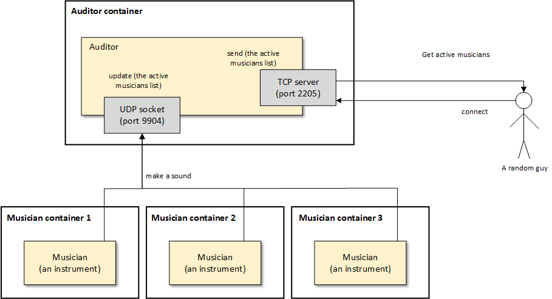

# Teaching-HEIGVD-RES-2017-Labo-DockerMusic

## Admin

* Every student must deliver a complete solution.
* It is up to you if you want to fork this repo, or if you prefer to work in a private repo. However, you have to use exactly the same directory structure for the validation procedure to work.
* There will not be a "full" lab grade for this long lab, but there will be one point to gain for the "salami" TE grade (i.e. it is one of the "challenges"). Also, the skills that you will learn during this lab will be necessary for subsequent labs.
* We expect that you will have more issues and questions than with other labs (because we have a left some questions open on purpose). Please ask your questions on telegram or in the forum, so that everyone in the class can benefit from the discussion.

## Objectives

This lab has 4 objectives:

* The first objective is to **design and implement a simple application protocol on top of UDP**. It will be very similar to the protocol presented during the lecture (where thermometers were publishing temperature events in a multicast group and where a station was listening for these events).

* The second objective is to get familiar with several tools from **the JavaScript ecosystem**. You will implement two simple **Node.js** applications. You will also have to search for and use a couple of **npm modules** (i.e. third-party libraries).

* The third objective is to get familiar with **Docker**. You will have to create 2 Docker images (they will be very similar to the images presented in the previous lecture). You will then have to run multiple containers based on these images.

* Last but not least, the fourth objective is to **work with a bit less upfront guidance**, as compared with previous labs. This time, we do not provide a complete webcast to get you started, because we want you to search for information (this is a very important skill that we will increasingly train). Don't worry, we have prepared a fairly detailed list of tasks that will put you on the right track. If you feel a bit overwhelmed at the beginning, make sure to read this document carefully and to find answers to the questions asked in the tables. You will see that the whole thing will become more and more approachable.


## Requirements

In this lab, you will **write 2 small NodeJS applications** and **package them in Docker images**:

* the first app, **Musician**, simulates someone who plays an instrument in an orchestra. When the app is started, it is assigned an instrument (piano, flute, etc.). As long as it is running, every second it will emit a sound (well... simulate the emission of a sound: we are talking about a communication protocol). Of course, the sound depends on the instrument.

* the second app, **Auditor**, simulates someone who listens to the orchestra. This application has two responsibilities. Firstly, it must listen to Musicians and keep track of **active** musicians. A musician is active if it has played a sound during the last 5 seconds. Secondly, it must make this information available to you. Concretely, this means that it should implement a very simple TCP-based protocol.


### Instruments and sounds

The following table gives you the mapping between instruments and sounds. Please **use exactly the same string values** in your code, so that validation procedures can work.

| Instrument | Sound         |
|------------|---------------|
| `piano`    | `ti-ta-ti`    |
| `trumpet`  | `pouet`       |
| `flute`    | `trulu`       |
| `violin`   | `gzi-gzi`     |
| `drum`     | `boum-boum`   |

### TCP-based protocol to be implemented by the Auditor application

* The auditor should include a TCP server and accept connection requests on port 2205.
* After accepting a connection request, the auditor should send a JSON payload containing the list of active musicians, with the following format (it can be a single line, without indentation):

```
[
  {
  	"uuid" : "aa7d8cb3-a15f-4f06-a0eb-b8feb6244a60",
  	"instrument" : "piano",
  	"activeSince" : "2016-04-27T05:20:50.731Z"
  },
  {
  	"uuid" : "06dbcbeb-c4c8-49ed-ac2a-cd8716cbf2d3",
  	"instrument" : "flute",
  	"activeSince" : "2016-04-27T05:39:03.211Z"
  }
]
```

### What you should be able to do at the end of the lab


You should be able to start an **Auditor** container with the following command:

```
$ docker run -d -p 2205:2205 res/auditor
```

You should be able to connect to your **Auditor** container over TCP and see that there is no active musician.

```
$ telnet IP_ADDRESS_THAT_DEPENDS_ON_YOUR_SETUP 2205
[]
```

You should then be able to start a first **Musician** container with the following command:

```
$ docker run -d res/musician piano
```

After this, you should be able to verify two points. Firstly, if you connect to the TCP interface of your **Auditor** container, you should see that there is now one active musician (you should receive a JSON array with a single element). Secondly, you should be able to use `tcpdump` to monitor the UDP datagrams generated by the **Musician** container.

You should then be able to kill the **Musician** container, wait 10 seconds and connect to the TCP interface of the **Auditor** container. You should see that there is now no active musician (empty array).

You should then be able to start several **Musician** containers with the following commands:

```
$ docker run -d res/musician piano
$ docker run -d res/musician flute
$ docker run -d res/musician flute
$ docker run -d res/musician drum
```
When you connect to the TCP interface of the **Auditor**, you should receive an array of musicians that corresponds to your commands. You should also use `tcpdump` to monitor the UDP trafic in your system.


## Task 1: design the application architecture and protocols

| #  | Topic |
| --- | --- |
|Question | How can we represent the system in an **architecture diagram**, which gives information both about the Docker containers, the communication protocols and the commands? |
| |  |
|Question | Who is going to **send UDP datagrams** and **when**? |
| | The **musician(s)** is/are going to send UDP datagram(s) every second. |
|Question | Who is going to **listen for UDP datagrams** and what should happen when a datagram is received? |
| | The **Auditor** is going to listen for UDP datagrams and with every datagram received, the list of active musicians will be update. |
|Question | What **payload** should we put in the UDP datagrams? |
| | The payload is in **JSON format** and contains : <br>- a uuid<br/> - the type of instrument<br/> - the sound made by the instrument |
|Question | What **data structures** do we need in the UDP sender and receiver? When will we update these data structures? When will we query these data structures? |
| | Every second an object, generated once and serialized in JSON, is sent by Each **Musician** as payload of an UDP datagram. The receiver (**Auditor** here) has a list of active musician, updated on each TCP datagram received. Each items in this list are the same object send by the musician with an additional information : the date of first activity of the musician. This list is sent (in JSON format again) to all TCP client connected to **Auditor**|


## Task 2: implement a "musician" Node.js application

| #  | Topic
| ---  | ---
|Question | In a JavaScript program, if we have an object, how can we **serialize it in JSON**?
| | `JSON.stringify(object)`
|Question | What is **npm**?
| | It's a package manager for the runtime **javascript** environment **node.js**.
|Question | What is the `npm install` command and what is the purpose of the `--save` flag?
| | - the `npm install` command installs and add the package to the project dependancies.<br> - the `--save` flag will save the package version in jour main **package.json** file.
|Question | How can we use the `https://www.npmjs.com/` web site?
| | By copying the url link and pasting it into your internet browser :D. More seriously, it's a website where the npm packages are stored. It provides informations about all available npm package.
|Question | In JavaScript, how can we **generate a UUID** compliant with RFC4122?
| | We can use a **node.js** package like **uuid** (that's what I have done for this lab).<br> 1) We create the variable that will contain the uuid module : `var uuid = require("uuid");`<br> 2) We generate a random v4 uuid : `uuid.v4()`.
|Question | In Node.js, how can we execute a function on a **periodic** basis?
| | `setInterval(<function_name_without_parenthesis>, <time_interval>)`
|Question | In Node.js, how can we **emit UDP datagrams**?
| | By using the **dgram** package to create a UDP socket and the `send()` method.
|Question | In Node.js, how can we **access the command line arguments**?
| | By the process variable (ex: `var instrument = process.argv[<argument_index>];`)


## Task 3: package the "musician" app in a Docker image

| #  | Topic
| ---  | ---
|Question | How do we **define and build our own Docker image**?
| | We create a **Dockerfile** and fill it with parameters used to build the docker image.
|Question | How can we use the `ENTRYPOINT` statement in our Dockerfile?
| | An `ENTRYPOINT` allows the configuration of a container that will run as an executable.
|Question | After building our Docker image, how do we use it to **run containers**?
| | -_- really...(see higher in the document)
|Question | How do we get the list of all **running containers**?
| | `docker ps`
|Question | How do we **stop/kill** one running container?
| | `docker kill <conatainer_name>` or `docker stop <container_name>`
|Question | How can we check that our running containers are effectively sending UDP datagrams?
| | we can use the snifer tool (**tcpdump**, **wireshark**, ...)


## Task 4: implement an "auditor" Node.js application

| #  | Topic
| ---  | ---
|Question | With Node.js, how can we listen for UDP datagrams in a multicast group?
| | 1) Create an UDP socket with the **dgram** package. <br/> 2) Use the `addMembership()` method on the socket to connect to the multicast group.
|Question | How can we use the `Map` built-in object introduced in ECMAScript 6 to implement a **dictionary**?
| | By using the `set()` method to add a key/value pair.
|Question | How can we use the `Moment.js` npm module to help us with **date manipulations** and formatting?
| | `Moment.js` provides all kinds of methods to parse, validate, manipulate and display dates and time in javascript. In this lab, I used the `Date()` method.
|Question | When and how do we **get rid of inactive players**?
| | Each time we received a datagram we update the $activeSince$ variable (for the corresponding musician) and every second, the program check iff a musican in the list has an outdated $activeSince$ value. If that's the case, the program remove it (in the program, a musician is clean after 5 seconds of inactivity).
|Question | How do I implement a **simple TCP server** in Node.js?
| | By using the **net** package and the **createServer()** method


## Task 5: package the "auditor" app in a Docker image

| #  | Topic
| ---  | ---
|Question | How do we validate that the whole system works, once we have built our Docker image?
| | *Enter your response here...*


## Constraints

Please be careful to adhere to the specifications in this document, and in particular

* the Docker image names
* the names of instruments and their sounds
* the TCP PORT number

Also, we have prepared two directories, where you should place your two `Dockerfile` with their dependent files.

Have a look at the `validate.sh` script located in the top-level directory. This script automates part of the validation process for your implementation (it will gradually be expanded with additional operations and assertions). As soon as you start creating your Docker images (i.e. creating your Dockerfiles), you should try to run it.
